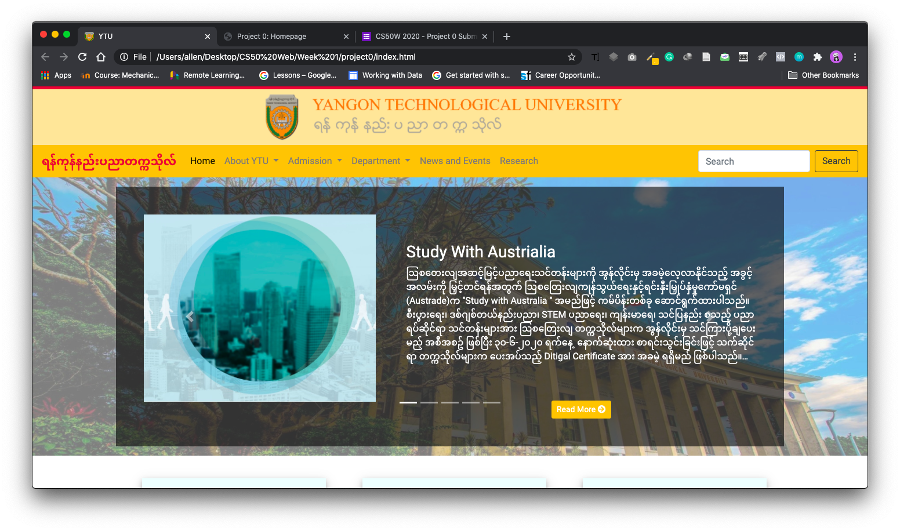
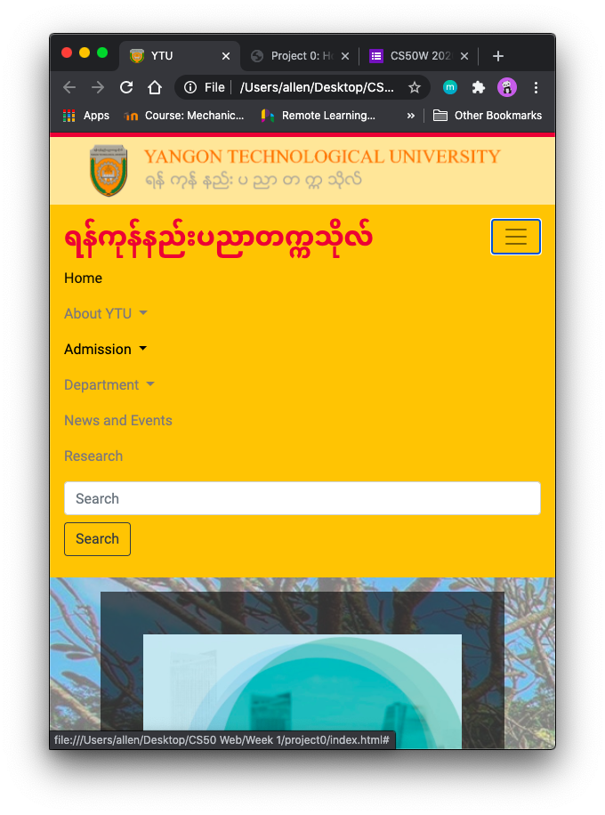

# CS50 Web Project 0
## YTU Homepage
Static Web Page sample of Yangon Technological University

Built using ```HTML```, ```SCSS```, ```Bootstrap``` and a bit of ```Javascript```

The Web Page is responsive enough in many devices and developed based on the original website [here](http://ytu.edu.mm).



The *time taken* for this project is approximately **4 days**, mostly spent on ```fixing responsiveness issues```.
